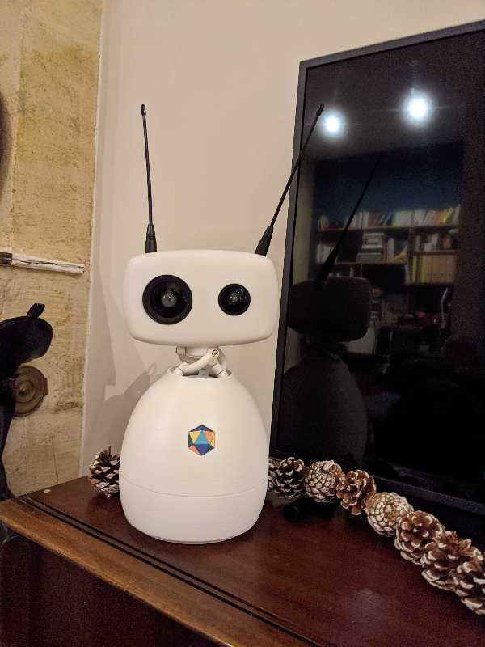

<!-- 
class: invert
paginate: true
footer: "Dissémination Robot Makers' Day – Denis Lapoire, Yoan Mollard"
-->

# Dissémination Robot Makers' Day

## EI9EE303
Option Robotique et apprentissage

### TODO + Tartu / Wien

---
## Objectifs

S'impliquer dans une opération de vulgarisation ou réseautage en robotique dans un cadre professionnel, événementiel ou éducatif.

### Tâches possibles
* Co-organisation d'événements et conférences
* logistique et communication d'un événement
* développement logiciel pour l'enseignement
* dispense d'heures d'enseignement ...

### Publics cibles
 Entreprises, familles, collégiens, chercheurs ...

---

## Projets de vulgarisation et réseautage proposées
* **Veille** sur Linkedin et Twitter hebdomadaire pour alimenter les comptes "Alumni roboticiens Bordeaux INP" et "Jobs/stages en robotique" 
* **DIMR** (Démonstrateurs interactifs de Médiation en Robotique) : créer des démonstrateurs robotique ludiques pour des manifestations tout public (objectif cette année : 100 ans de l'ENSEIRB-MATMECA)
* "**AI4Industry**" : S'impliquer dans l'organisation des conférences, job dating et TP
* Coordonner l'opération "**Dans les pas d'un dirigeant d'entreprise**"
* Délégué.e de classe
* Proposez le vôtre

Un projet peut avoir des sous-projets : 1 équipe possible par sous-projet.

---
# Détail des projets et sous-projets

---
## Veille hebdomadaire Linkedin et Twitter

Le parcours robotique a mis en place des comptes de réseaus sociaux :
* **Promos robotiques Bordeaux INP** ([Linkedin](https://www.linkedin.com/groups/8843247/)) ; où sont invités tous les actuels et anciens du parcours robot pour continuer à garder contact
* **Jobs et stages en robotique en France et en Europe** ([Twitter](https://twitter.com/JobsEnRobotique) + [Linkedin](https://www.linkedin.com/groups/8966637/)) ; où sont relayés toutes les offres pouvant intéresser des étudiants ou chercheurs d'emploi en robotique au sens large (mécatronique, automatismes, ROS, robotique industrielle, de service ...)

Ce projet consiste à participer à l'**animation** de ces 3 comptes. Vous serez nommés administrateurs des pages et devrez assurer une **veille hebdomadaire** pour poster ou relayer toute information pertinente et ainsi faire vivre ces réseaux !

---

## DIMR Robot sondeur

Un robot qui sonde les visiteurs sur une question et inscrit le résultat des votes sur un tableau blanc, par ex :

> Les robots vous inspirent-ils confiance ou méfiance ?

[Le code](https://github.com/Bordeaux-INP/cs_sawyer) a été créé pour l'exposition ROBOTS de Cap Sciences en 2019, il suffit de le rafraichir et le packager pour les 100 ans d'ENSEIRB MATMECA.

Il faudra s'assurer de son fonctionnement pendant l'événement.

---
## DIMR Borne photo Reachy Baby

Reachy est un robot semi-humnoïde conçu pour l'interaction homme-robot.

Il s'agit de monter Reachy sur un piedestal équipé d'une imprimante et le transformer en borne photo libre-service pour les 100 ans d'ENSEIRB-MATMECA et s'assurer de son fonctionnement pendant l'événement.

Il n'existe pas de base de code à ce jour.

---
## Organisation AI4Industry et Robot Makers' day
Ces deux événements sont organisés par le Parcours Robotique pour :
* enseigner la robotique et l'IA
* réseauter et faire connaissance avec de nouvelles entreprises

Ce projet consiste à aider à l'organisation de ces événements, en amont ainsi que sur place.

---
## Dans les pas d'un dirigeant d'entreprise
L’objectif est de fournir aux élèves-ingénieurs un aperçu concret du
**métier de dirigeant d’entreprise**. Le moyen employé est de permettre à chaque élève-ingénieur de suivre, au cours d'une journée, l'ordinaire des actes
professionnels d’un dirigeant industriel. Il s’agit d'appréhender la complexité des tâches d'un dirigeant, dans le champ technologique, juridique, RH, commercial ...

- chacun des N élèves-ingénieurs est accueilli par un des N dirigeants
d’entreprise durant une journée.
- l’élève-ingénieur accompagne le dirigeant dans chacun de ses actes
professionnels au cours de sa journée de travail

Ce sujet consiste à **coordonner** cette rencontre pour les élèves de la promo et s'assurer que chacun.e parvient à organiser sa journée avec un dirigeant.

---
## Délégué.e de classe

Un ou une délegué.e.

---
# Déroulement et temps de travail
La temporalité de votre opération ne pouvant coïncider exactement avec le planning du syllabus, votre implication dans l'opération nécessite un travail étalé sur toute l'année (Octobre 21 à Juin 22) accordément aux tâches requises par le projet.

## Absences 
Déroulement des projets **en simultané** avec les cours, pouvant donner lieu à des autorisations d'absence exceptionnelles **à anticiper** si cela est véritablement justifié. Demande possible au maitre de stage avec son accord.

---
## Evaluation
L'évaluation est effectuée : 
* en **continu** sur le semestre : donnez des nouvelles à votre encadrant régulièrement et soyez proactif si votre projet n'avance pas ou s'il vous manque des infos
* évaluation **finale** : un mail organisé et synthétique pour faire le bilan de vos actions pour votre projet

---
# Répartition des équipes-projets

|   Sous-projet   |     Encadrant     | Noms des élèves (+ chef de projet) |
|:---------------:|:-----------------:|:-----------------:|
| Veille hebdo Linkedin/Twitter | YM |
| DIMR robot sondeur | YM |
| DIMR borne photo Reachy | YM |
| Dans les pas d'un dirigeant | DL |
| Orga AI4Industry & RMD | DL |
| Délégué de classe (1 étudiant.e) | DL |

---
# Contact encadrants
Yoan Mollard (YM) yoan.mollard@bordeaux-inp.fr
Denis Lapoire (DL) denis.lapoire@enseirb-matmeca.fr
